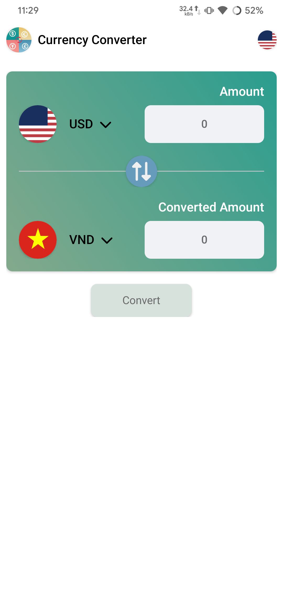
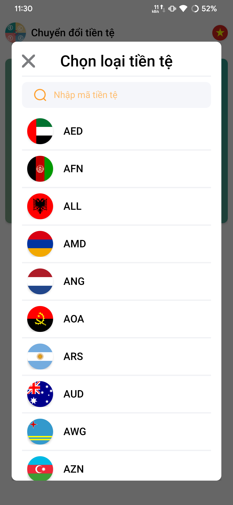
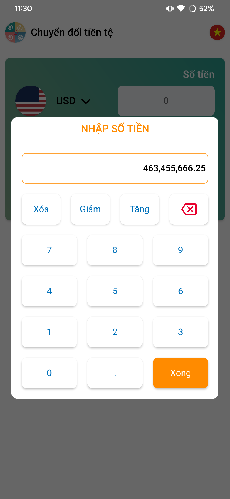
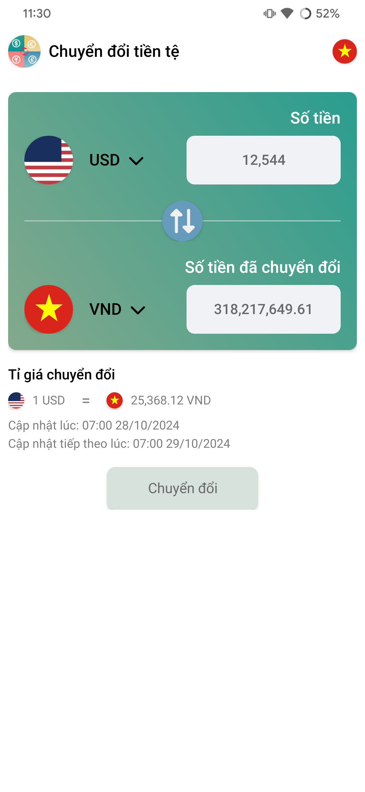
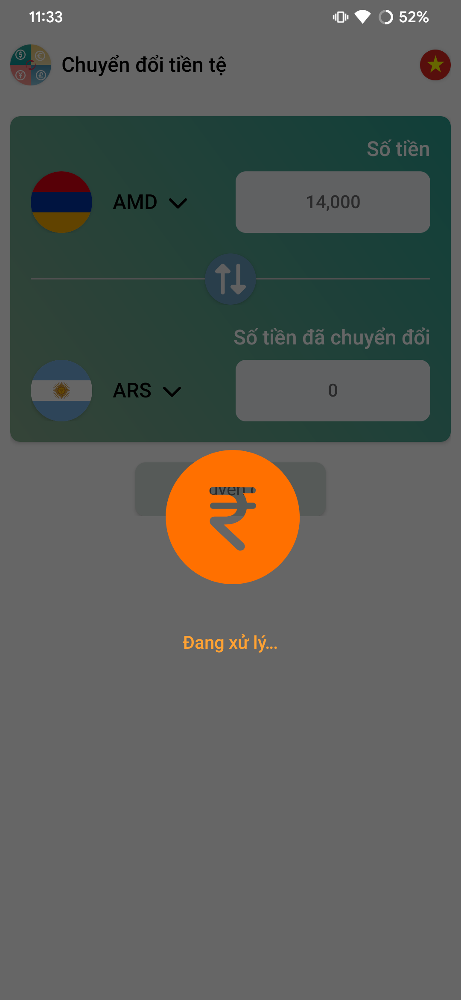
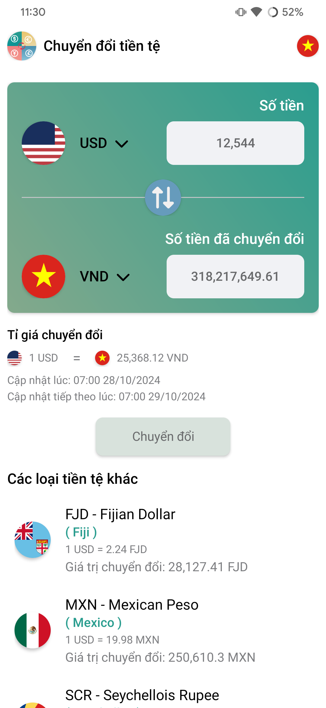

# Currency Converter App

A simple Currency Converter app built with Kotlin for Android. The app allows users to input an amount, select currencies to convert from and to, and view live converted currency values using exchange rates from ExchangeRate-API. The app is developed using MVVM architecture and clean architecture principles to ensure separation of concerns and maintainable code structure.

## Pictures

<div style="display: flex; justify-content: space-between;">
  
  
  
  
  
  
  
  
  
  
  
</div>

# File APK

[File here](https://github.com/xuandieu2k/currency_converter/app-release.apk)


## Demo

A video demonstrating the app's key features is available at [Demo Video Link](https://www.youtube.com/watch?v=qHseWzS93es).

## Features

- Input an amount and select currencies to convert from and to.
- Fetch live exchange rates from ExchangeRate-API.
- Display the converted amount.
- Basic error handling for network failure or invalid input cases.
- User-friendly UI design.

## Technical Stack

- **Language:** Kotlin
- **Architecture:** MVVM and Clean Architecture
- **Dependency Injection:** Hilt and Dagger
- **API:** [ExchangeRate-API](https://app.exchangerate-api.com/)

## App Structure

### Modules

- **Data Layer:** Handles data operations, including API interactions and model data management.
- **Domain Layer:** Contains use cases that encapsulate business logic.
- **Presentation Layer:** Manages UI and interactions between UI components and the ViewModel.

### Error Handling

Basic error handling is implemented to manage cases such as network failure, no internet connectivity, and invalid inputs.

## Installation

1. Clone the repository:

   ```bash
   git clone https://github.com/xuandieu2k/currency_converter.git
   ```

2. Open the project in Android Studio.

3. Build and run the app on an Android device or emulator.

## Testing

Basic unit tests are provided to validate core functionality. Additional test cases can be added to further ensure app reliability.

---

# Challenge 2 Solutions

The solutions to the coding exercises are provided in the `Challenge2` folder. Each solution is written in Kotlin.

## 2.1 Product Inventory Management

- **Total Inventory Value Calculation**: Computes the total value of all products in stock.
- **Most Expensive Product Finder**: Identifies the product with the highest price.
- **Product Stock Check**: Verifies if a specific product (e.g., "Headphones") exists in the inventory.
- **Sorting Options**: Allows sorting products in ascending or descending order by price or quantity.

## 2.2 Array Manipulation and Missing Number Problem

- **Missing Number Finder**: Finds the missing number in an array of distinct numbers from 1 to n + 1.

---

## Store

The Challenge 2 source code is stored in the Challenge 2 directory of the original source code and is located in the Main.kt file.
[Here](https://github.com/xuandieu2k/currency_converter/tree/main/Challenge2)


## Notes & Challenges

- **API Constraints**: The free tier of ExchangeRate-API may have rate limits.
- **Testing Limitations**: Due to limited time, tests focus on core functionality, with room for expanding coverage.
